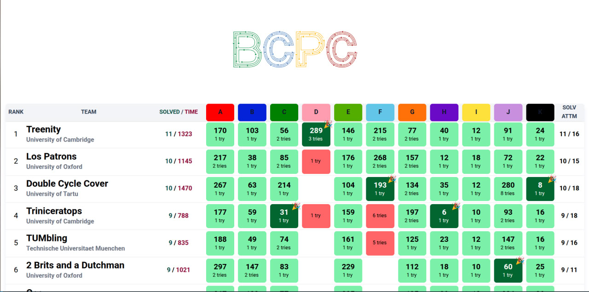

# Demo



<hr>

React + TypeScript + Vite + bun

### TODO

- [x] Hotfix the sorting rank //If two teams have the same score, they are sorted by the time of their last accepted submission.
- [x] Add themes
- [x] Fix the Cors error 
- [ ] Add preview
- [ ] Add static version
- [ ] Responsive design(if we deploy in backend service and share with others)
- [x] Handle the judging types
- [x] dynamic the reanking number
- [x] fix the animation
- [x] Add example of .env file
- [x] Write little docuemnt for how this work and how to config that!
- [ ] Handle the keyboard next controling(example n) 
- [ ] Add document for functions in scorboard component 
- [ ] Refactor the scoreboard component
- [ ] Add img preview for each team to show in popup

# Lets use it!

### Install the package with bun :

```bash
bun install && bun start
```

### If you want run with pnpm or npm :
```bash
pnpm install
node cors-proxy.js &
pnpm run dev
```
```bash
npm install
node cors-proxy.js &
npm run dev
```


### env file : 
copy The .env.example to .env:
> [!NOTE]
> You CAN SEE THE EXAMPLE IN FILE.

| Variable              | Description                                                                                              |
| --------------------- | -------------------------------------------------------------------------------------------------------- |
| **VITE_API_BASE_URL** | The base URL of your proxied DOMjudge API.                               |
| **VITE_API_USERNAME** | Username for authenticating with the DOMjudge API (usually an admin or judge account).                   |
| **VITE_API_PASSWORD** | Password for the API user.                                                                               |
| **VITE_API_CID**      | Contest ID to pull data from. Must match the contest ID in DOMjudge.                                     |
| **VITE_API_PENALTY**  | Penalty time (in minutes) applied per wrong submission.                                                  |

<hr>

Browsers block API requests to different origins (domains or ports) by default because of CORS (Cross-Origin Resource Sharing) restrictions.
To bypass this safely during development, we use a CORS proxy server powered by cors-anywhere

`You should use node to run the cors-proxy file then run the project`
```
node cors-proxy.js
```


### If for any reason you don't want to use the proxy you can run chrome or other browser without web-security : 

For chrome :
```bash
mkdir chromeCashe
cd chromeCashe
google-chrome-stable --user-data-dir="./" --disable-web-security
```

For the firefox : About:config and the security.fileuri.strict_origin_policy. Sometimes also the network.http.refere.XOriginPolicy. Im not sure:))
